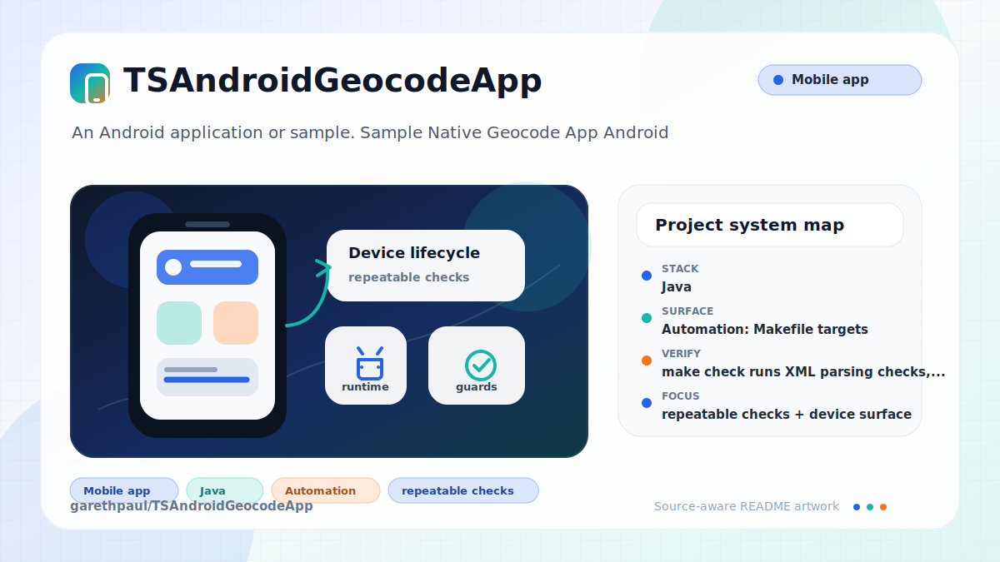

# TSAndroidGeocodeApp

<!-- README-OVERVIEW-IMAGE -->


## Overview

`garethpaul/TSAndroidGeocodeApp` is an Android application or sample. Sample Native Geocode App Android

This README is based on the checked-in source, manifests, scripts, and repository metadata on the `master` branch. The project language mix found during review was: Java (5).

## Repository Contents

- `app` - source or example code
- `CHANGES.md` - maintenance history for Android contract checks
- `Makefile` - local verification entry points
- `docs/plans` - completed maintenance plans for the current baseline
- `plans` - historical implementation notes
- `scripts` - static Android contract validators
- `SECURITY.md` - security reporting and disclosure guidance
- `VISION.md` - project direction and maintenance guardrails

Additional scan context:

- Source directories: app
- Dependency and build manifests: app/build.gradle
- Entry points or build surfaces: Gradle build files
- Test-looking files: app/src/androidTest/java/com/sample/foo/tsgeocodeapp/ApplicationTest.java

## Getting Started

### Prerequisites

- Git
- Android Studio or a compatible Android SDK
- Gradle or the checked-in Gradle wrapper when present

### Setup

```bash
git clone https://github.com/garethpaul/TSAndroidGeocodeApp.git
cd TSAndroidGeocodeApp
```

The setup commands above are derived from repository files. Legacy mobile, Python, or JavaScript samples may require older SDKs or package versions than a modern workstation uses by default.

## Running or Using the Project

- Use Android Studio to open the `app` module with an Android SDK that supports the legacy Gradle and support-library versions.
- Run `make check` for repository static checks. The `build` step runs Gradle only when a wrapper or root `settings.gradle` is available.

## Testing and Verification

- `make check` runs XML parsing checks, manifest/service/activity contract
  checks, Gradle application-id checks, and coordinate input guard checks.
- Static checks also require completed canonical plans under `docs/plans`.
- Android Studio's test runner when the matching legacy SDK is configured

When the required SDK or runtime is unavailable, use static checks and source review first, then verify on a machine that has the matching platform toolchain.

## Configuration and Secrets

- No required secret or credential file was identified in the repository scan. If you add integrations later, keep secrets out of git.

## Security and Privacy Notes

- Review changes touching network requests, sockets, or service endpoints; examples from the scan include app/src/androidTest/java/com/sample/foo/tsgeocodeapp/ApplicationTest.java, app/src/main/AndroidManifest.xml, app/src/main/res/layout/activity_main.xml.
- Review changes touching mobile permissions or privacy-sensitive device data; examples from the scan include app/src/main/AndroidManifest.xml, app/src/main/java/com/sample/foo/tsgeocodeapp/GeocodeAddressIntentService.java, app/src/main/java/com/sample/foo/tsgeocodeapp/MainActivity.java, app/src/main/java/com/sample/foo/tsgeocodeapp/MainActivityWithAsyncTask.java, and 1 more.
- Review changes touching file, media, JSON, XML, CSV, OCR, or data parsing; examples from the scan include app/src/main/res/layout/activity_main.xml, app/src/main/res/values-w820dp/dimens.xml.

## Maintenance Notes

- This looks like a legacy Android project or sample. Expect Android SDK, Gradle, and support-library versions to matter.
- See `SECURITY.md` for vulnerability reporting and safe research guidance.
- See `VISION.md` for project direction and contribution guardrails.
- See `docs/plans/2026-06-08-tsandroidgeocodeapp-baseline.md` for the
  canonical Android geocode contract baseline.

## Contributing

Keep changes small and tied to the project that is already present in this repository. For code changes, document the toolchain used, avoid committing generated dependency directories or local configuration, and update this README when setup or verification steps change.
