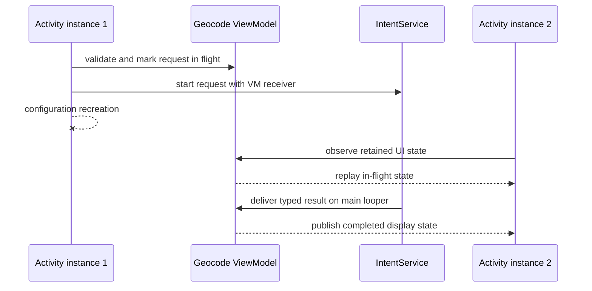

# Activity Recreation Result State

## Status: Completed

## Summary

Retain an accepted geocode request and its latest result across Activity
configuration recreation without retaining the destroyed Activity. A screen
ViewModel will own the main-thread receiver and observable UI state while each
Activity instance remains responsible only for rendering that state.

## Problem Frame

The current weak Activity receiver prevents leaks and stale-view updates, but
it intentionally discards a result delivered after rotation. The recreated
Activity also re-enables dispatch while the original service request is still
running, so users can start duplicate work and never see the first result.

## Requirements

- R1. Retain one in-flight request state through Activity configuration
  recreation without storing an Activity, View, or Context in retained state.
- R2. Deliver the service result through a main-thread receiver owned by the
  retained screen state rather than by an Activity instance.
- R3. Expose lifecycle-aware immutable UI state so a recreated Activity
  immediately restores progress, action-button availability, and the latest
  successful or failed result.
- R4. Preserve all existing input validation, geocoder availability, typed
  receiver extraction, payload guards, privacy, and single-in-flight behavior.
- R5. Clear the in-flight state for every delivered success, failure, null, or
  malformed payload while keeping the latest safe display result replayable.
- R6. Add executable unit coverage and mutation-sensitive static contracts for
  state transitions, retained ownership, Activity observation, and dependency
  wiring.
- R7. Record the completed implementation, current Android lifecycle guidance,
  validation evidence, and remaining process-death/device boundaries.

## Key Technical Decisions

- **Use an Activity-scoped ViewModel with LiveData:** Android's screen state
  holder survives configuration changes, and lifecycle-aware observation
  automatically detaches the destroyed Activity and replays the latest state
  to its replacement.
- **Keep the receiver inside the ViewModel boundary:** The receiver uses the
  main looper and mutates retained state only; it never references an Activity
  and therefore cannot leak or call stale views.
- **Represent rendering as an immutable state value:** One value carries
  in-flight status and an optional typed result payload so UI controls cannot
  drift across separate callbacks or recreation.
- **Pin Lifecycle 2.9.4 artifacts:** This is the newest stable line compatible
  with the app's API 21 floor. Lifecycle 2.10.0 raises `minSdk` to API 23, so
  adopting it requires a separate product-support decision.
- **Do not claim process-death durability:** ViewModel retention covers
  configuration recreation within the process. Persisting or resuming an
  external service callback after process death requires a different request
  ownership architecture.

## High-Level Technical Design

## Scope Boundaries

### In Scope

- Configuration-change retention for one accepted request and its latest
  display result.
- Activity-scoped ViewModel and lifecycle-aware observation in the existing
  Java/Views application.
- Executable state-transition tests plus static integration contracts.

### Deferred to Follow-Up Work

- Replacing deprecated `IntentService` with a modern worker or repository
  abstraction.
- Emulator-driven rotation tests and live geocoder-provider tests.
- Raising the application floor from API 21 to API 23 so Lifecycle 2.10 or
  newer can be adopted.

### Out of Scope

- Process-death recovery, persisted request identifiers, cancellation,
  distributed request ownership, or background delivery after app restart.
- Changes to geocoding inputs, service result schemas, address rendering, or
  user-visible copy beyond restoring the existing result.

## Implementation Units

### U1. Add retained geocode screen state

**Goal:** Own the receiver, in-flight flag, and latest typed result outside the
Activity while retaining no UI object.

**Requirements:** R1, R2, R5, R6

**Dependencies:** None

**Files:**
- `app/src/main/java/com/sample/foo/tsgeocodeapp/GeocodeViewModel.java`
- `app/src/test/java/com/sample/foo/tsgeocodeapp/GeocodeViewModelTest.java`
- `app/build.gradle`

**Approach:** Add stable AndroidX Lifecycle dependencies and a Java ViewModel
whose immutable state is exposed as `LiveData`. Its main-looper receiver
publishes safe success/failure payloads and always settles the in-flight flag.
Keep Android result interpretation at this state boundary so tests can prove
null and malformed payload behavior without an Activity reference.

**Execution note:** Implement the state transitions test-first.

**Patterns to follow:** Existing service result constants and the defensive
payload handling currently in `MainActivity.handleGeocodeResult`.

**Test scenarios:**
- A newly created state holder is idle and has no display result.
- Beginning a request publishes an in-flight state and rejects a second begin.
- Success with a valid address publishes an idle success state.
- Failure with a nonblank message publishes an idle failure state.
- Null bundles, missing addresses, and blank failure messages publish the
  existing safe fallback while settling the request.
- The state holder and receiver contain no Activity, View, or Context field.

**Verification:** JVM tests prove every transition and the production receiver
delegates through the same transition boundary.

### U2. Render retained state from each Activity instance

**Goal:** Restore progress, action availability, and the latest result after
configuration recreation without duplicate service dispatch.

**Requirements:** R1, R2, R3, R4, R5

**Dependencies:** U1

**Files:**
- `app/src/main/java/com/sample/foo/tsgeocodeapp/MainActivity.java`

**Approach:** Obtain the Activity-scoped ViewModel in `onCreate`, observe its
state with the Activity lifecycle, and render all request/result UI from one
method. Start the service only after the state holder atomically accepts the
request, pass its receiver, and remove the weak Activity receiver entirely.

**Patterns to follow:** Current validation ordering, typed service receiver,
and shared `showResultText` fallback behavior.

**Test scenarios:**
- A recreated observer receives the current in-flight state and leaves the
  action disabled while the original service request runs.
- A result delivered after recreation is rendered by the active Activity.
- Invalid input and unavailable geocoder paths never mark a request in flight.
- Every result path restores progress and action availability exactly once.

**Verification:** Static integration contracts prove ViewModel acquisition,
lifecycle observation, receiver ownership, validation ordering, and removal of
Activity-retaining callback code; hosted Android compilation verifies APIs.

### U3. Enforce lifecycle contracts and maintenance evidence

**Goal:** Make the recreation guarantee mutation-sensitive and durable for
future maintainers.

**Requirements:** R4, R6, R7

**Dependencies:** U1, U2

**Files:**
- `scripts/check_android_contracts.py`
- `README.md`
- `SECURITY.md`
- `VISION.md`
- `CHANGES.md`
- `docs/plans/2026-06-17-activity-recreation-result-state.md`

**Approach:** Extend static contracts for stable dependency pins, retained
ownership, observer wiring, single-in-flight ordering, and absence of Activity
references in the receiver. Add hostile mutations that remove or invert each
load-bearing guarantee, then record actual validation and platform limits.

**Test scenarios:**
- Reject moving the receiver back into the Activity or adding an Activity field
  to retained state.
- Reject removing lifecycle observation, in-flight replay, settlement, or the
  stable Lifecycle dependency pin.
- Reject dispatching the service before retained state accepts the request.
- Reject documentation or plan claims that omit the process-death boundary.

**Verification:** Repository-root and external-directory gates pass, all
mutations are rejected, generated artifacts and credentials are absent, and
the exact hosted Android head is terminal green.

## Risks And Mitigations

- **LiveData can replay a completed result on recreation:** This is intentional
  because the result is screen state, not a one-shot navigation event. Rendering
  is idempotent and does not restart service work.
- **The service can outlive the process:** ViewModel cannot solve process death.
  Documentation and tests must state this boundary rather than implying durable
  background delivery.
- **Dependency drift can weaken reproducibility:** Pin Lifecycle 2.9.4 and add
  a static contract matching the existing explicit dependency style.
- **The default shell selects Java 8:** Run local Android validation with the
  shared Temurin 17 toolchain and Android SDK explicitly selected, and require
  the hosted JDK 17 Android job before terminal completion.

## Sources And Research

- Android Developers, `ViewModel overview`: ViewModel is the screen-level state
  holder that persists state through configuration changes.
- Android Developers, `LiveData overview`: lifecycle-aware observers detach at
  destruction and receive the latest value after recreation.
- Android Developers, `ResultReceiver`: a supplied Handler determines the
  callback thread.
- AndroidX Lifecycle release notes: 2.9.4 is the newest stable line compatible
  with API 21; 2.10.0 is stable but raises the library floor to API 23, and
  2.11.0 remains a release candidate as of June 17, 2026.

## Verification

- The focused JDK 17 `GeocodeViewModelTest` suite passed all ten retained-state
  tests after compiling the complete debug Java source set.
- Repository-root and external-directory `make check` passed all seven static
  contract groups, fifteen JVM tests, debug assembly, and warnings-as-errors
  Android lint with Temurin 17 and Android SDK 36.
- Mutation-sensitive contracts cover retained ownership, lifecycle observation,
  admission ordering, startup rollback, result settlement, dependency pins,
  documentation, and completed-plan evidence.
- Exact diff, generated artifact, credential pattern, staged path, upstream,
  and hosted exact-head evidence are audited before terminal completion.
